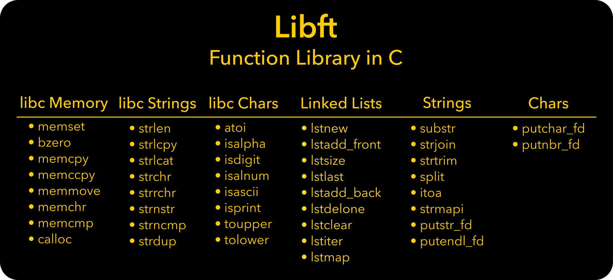

## How to run

First clone the repository and compile the library

`git clone https://github.com/secullod/libft.git`
`cd libft`
`make`

I have included a main.c file which can be used to test any function in the library.

You must first link the main.c file to the library by the below command.

`gcc main.c libft`

Then type `./a.out` to run the functions you have called inside of the main.c file

## Resources